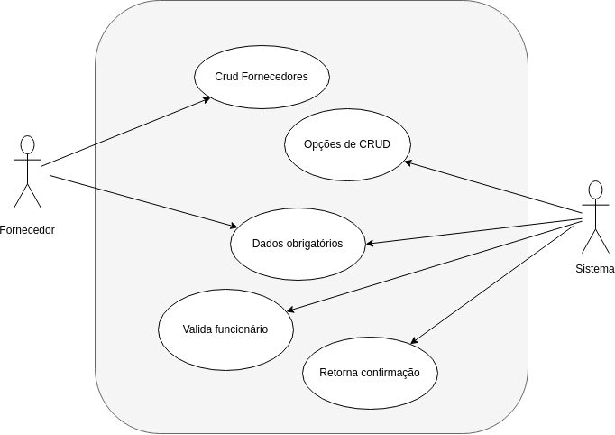
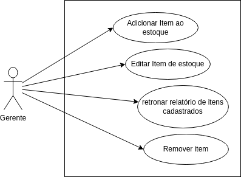
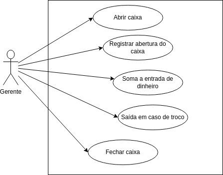
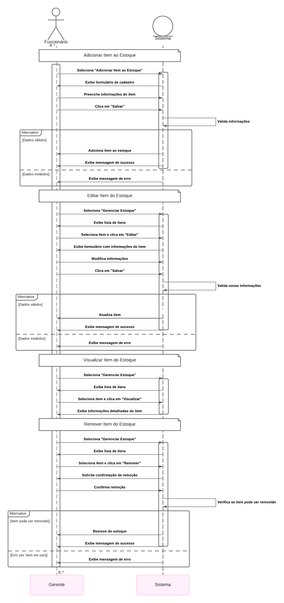
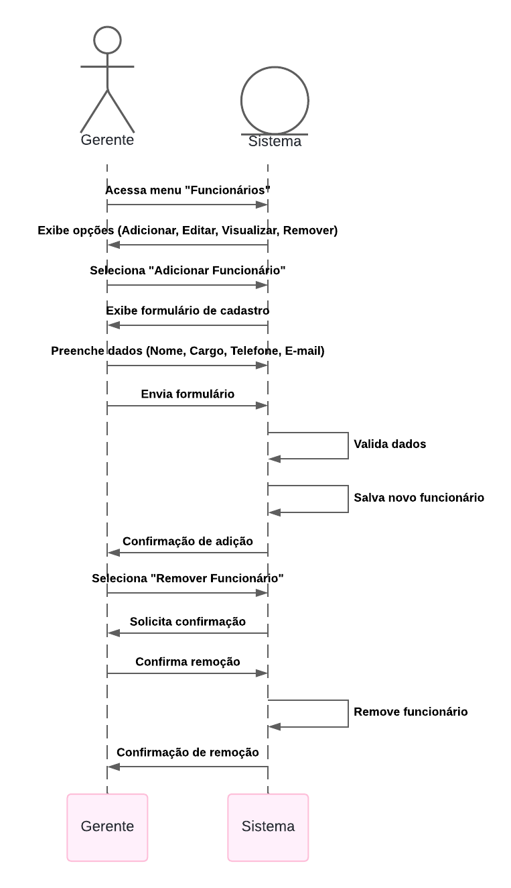
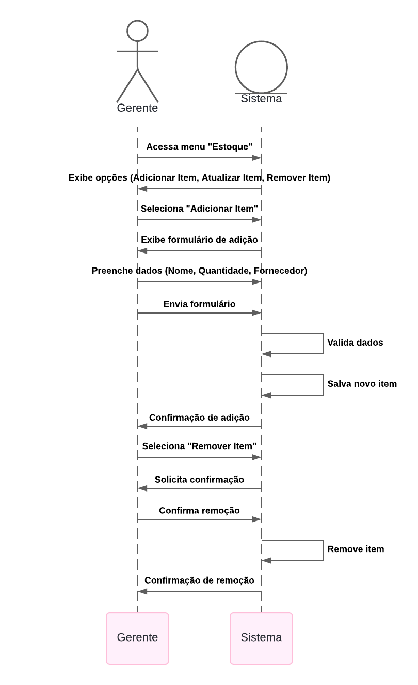
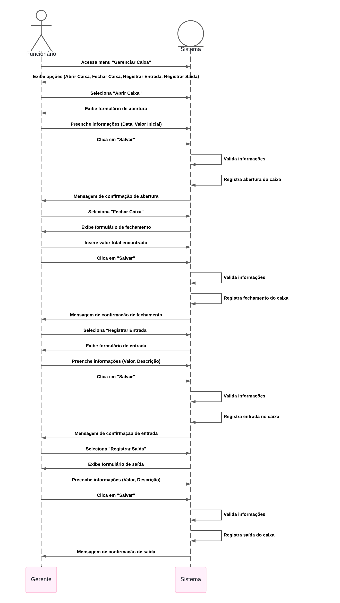

# Sistema de Gestão de Sorveteria
## Sumário
1. [VISÃO GERAL DO SISTEMA](#1-visão-geral-do-sistema)
2. [LEVANTAMENTO DE REQUISITOS](#2-levantamento-de-requisitos)

   2.1. [REQUISITOS FUNCIONAIS](#requisitos)
   
   2.2. [REQUISITOS NÃO FUNCIONAIS](#requisitos-não-funcionais)
   
   2.3. [REQUISITOS SUPLEMENTARES](#requisitos-suplementares)
3. [DETALHAMENTO DE REQUISITOS](#3-detalhamento-dos-requisitos)
4. [CASOS DE USO](#4-casos-de-uso)
5. [DIAGRAMA DE SEQUÊNCiA ](#5-diagrama-de-sequência)
6. [MODELO CONCEITUAL](#6-modelo-conceitual)
8. [DIAGRAMA DE COMUNICAÇÃO](#7-diagrama-de-comunicação)
7. [DIAGRAMA DE CLASSES](#8-diagrama-de-classes)

## 1. Visão Geral

## 2. LEVANTAMENTO DE REQUISITOS

## Requisitos
1. Gerenciar Estoque
2. Gerenciar Funcionarios
3. Gestão de Fornecedores
4. Gerenciar Caixa

### Requisitos Não Funcionais
1. O sistema deve registrar a entrada e saida de estoque.

2. O sistema deve fornecer aviso de estoque baixo automaticamente quando um produto atingir o limite mínimo configurado.

3. O sistema deve emitir avisos sobre a validade do estoque, notificando os responsáveis com pelo menos 7 dias de antecedência da data de vencimento.

4. O sistema deve cadastrar os funcionários por meio de níveis hierárquicos, definindo permissões adequadas de acordo com seus cargos na empresa.

5. Os funcionários devem se cadastrar no sistema utilizando CPF e senha, garantindo a identificação única e segura.

6. O sistema deve controlar as funções de cada funcionário e permitir acessos restritos conforme seu nível hierárquico e responsabilidades.

7. O sistema deve armazenar os seguintes dados dos fornecedores: Nome, CNPJ, Telefone, Endereço e formas de pagamento aceitas.

8. O sistema deve manter um histórico completo de compras realizadas com cada fornecedor, incluindo datas, produtos adquiridos e valores pagos.

9. O sistema deve permitir a abertura e fechamento do caixa, registrando o valor inicial e final, com histórico das transações realizadas.

10. O sistema deve suportar várias formas de pagamento, como dinheiro, cartão e pagamentos eletrônicos.

11. O sistema deve gerenciar automaticamente o troco, calculando o valor a ser devolvido ao cliente com base no pagamento realizado.

12. A abertura e fechamento de caixa deve ser realizada apenas por funcionários autorizados, de acordo com o nível de seu cargo na hierarquia.

13. O sistema deve permitir o estorno e cancelamento de produtos ou vendas, mediante autorização de um responsável.

14. O sistema deve estar totalmente integrado ao estoque, atualizando automaticamente as quantidades de produtos após cada venda.

15. O sistema deve gerar relatórios financeiros detalhados após o fechamento do caixa, mostrando total de vendas, forma de pagamento, e divergências de valores (se houver).

### Requisitos Suplementares
1. O sistema deve operar via plataforma desktop.
2. O sistema deve utilizar o banco de dados postgres.
3. O sistema deve utilizar a linguagem Java.
4. O sistema deve utilzar o Spring Security para realizar a segurança de acesso.
5. O sistema deve gerar relatorios por meio da biblioteca JasperReports.

## 3. Detalhamento dos Requisitos
| **RF1. Gerenciar Estoque** |
|:---|
| **Descrição:** Este requisito estabelece a necessidade de um sistema abrangente para o gerenciamento de estoque da sorveteria, que permita o controle eficiente de entradas e saídas de produtos. O sistema deve garantir a precisão nas informações de estoque, possibilitando um acompanhamento em tempo real da quantidade disponível. Além disso, deve incluir funcionalidades para monitorar a validade dos produtos e emitir alertas automáticos quando os níveis de estoque atingirem limites críticos, evitando desperdícios e assegurando a disponibilidade de produtos para os clientes.|
| **Fontes:** Departamento responsavel pelo estoque e feedback interno dos funcionarios|
| **Usuários:** Funcionarios do estoque, Gerente ou Admnistrador do setor de estoque e Administradores do Sistema|
| **Informações de entrada:** Dados do Produto: Informações detalhadas sobre os produtos, incluindo nome, descrição, unidade de medida, quantidade inicial e data de validade. Registro de Movimentações: Dados referentes a cada movimentação de estoque, como tipo de operação, quantidade movimentada, data da operação e identificação do usuário responsável pela ação. | 
| **Informações de saída:** Relatórios de Estoque: Documentos gerados que fornecem uma visão geral do estoque, incluindo quantidades disponíveis, produtos com validade próxima e um histórico detalhado de todas as movimentações. Alertas de Estoque Crítico: Notificações automáticas que informam os usuários quando os níveis de estoque de produtos específicos estão abaixo do mínimo estabelecido, permitindo ações rápidas de reposição. Avisos de Validade: Comunicações sobre produtos que estão próximos do vencimento, sugerindo ações como promoções ou descarte, a fim de minimizar perdas. |
| **Requisitos não funcionais:** RNF 1: O sistema deve registrar a entrada e saida de estoque.  RNF 2: O sistema deve fornecer aviso de estoque baixo automaticamente quando um produto atingir o limite mínimo configurado  RNF 3: O sistema deve emitir avisos sobre a validade do estoque, notificando os responsáveis com pelo menos 7 dias de antecedência da data de vencimento.|

---

| **RF2. Gerenciar Funcionarios** |
|:---|
| **Descrição:** Este requisito especifica a implementação de um sistema para gerenciar a equipe da sorveteria, permitindo o cadastro, controle e monitoramento dos funcionários. O sistema deve oferecer a capacidade de definir diferentes níveis de acesso e hierarquias, assegurando que as funções e responsabilidades sejam claramente definidas. Além disso, deve incluir funcionalidades para registro de dados pessoais, autenticação de usuários e controle de permissões, garantindo a segurança e integridade das informações.|
| **Fontes:** Administradores da empresa e RH|
| **Usuários:** Administradores do Sistema, Funcionários e Gerentes de Recursos Humanos|
| **Informações de entrada:** Dados do Funcionário: Informações pessoais, incluindo nome, CPF, cargo, data de contratação e informações de contato. Credenciais de Acesso: Cadastro de login e senha para cada funcionário, além de dados relacionados ao nível de acesso. | 
| **Informações de saída:** Notificações de Acesso: Mensagens informando sobre tentativas de login, alterações nas permissões e atualizações nos dados dos funcionários. Histórico de Atividades: Registros das atividades realizadas por cada funcionário dentro do sistema, permitindo auditorias e avaliações de desempenho. |
| **Requisitos não funcionais:** RNF 4: O sistema deve cadastrar os funcionários por meio de níveis hierárquicos, definindo permissões adequadas de acordo com seus cargos na empresa.  RNF 5: Os funcionários devem se cadastrar no sistema utilizando CPF e senha, garantindo a identificação única e segura.  RNF 6: O sistema deve controlar as funções de cada funcionário e permitir acessos restritos conforme seu nível hierárquico e responsabilidades.|

---

| **RF3. Gestão de Fornecedores** |
|:---|
| **Descrição:** Este requisito define a necessidade de um sistema para gerenciar as informações e interações com os fornecedores da sorveteria. O sistema deve permitir o cadastro detalhado de fornecedores, incluindo dados como nome, CNPJ, telefone, endereço e formas de pagamento aceitas. Além disso, deve possibilitar o acompanhamento histórico de compras realizadas, facilitando a avaliação de desempenho e a tomada de decisões estratégicas relacionadas ao abastecimento.|
| **Fontes:** Setor financeiro e Gerente de compras|
| **Usuários:** Gerente de Compras, Gerente Financeiro, funcionarios de estoque, gerente de estoque e admnistradores do sitema|
| **Informações de entrada:** Dados do Fornecedor: Informações detalhadas, incluindo nome, CNPJ, telefone, endereço e formas de pagamento aceitas. Histórico de Compras: Registros de todas as transações realizadas com cada fornecedor, incluindo data, produtos adquiridos, quantidades e valores. | 
| **Informações de saída:** Relatórios de Fornecedores: Documentos que fornecem uma visão geral dos fornecedores cadastrados, incluindo informações de contato e avaliação de desempenho com base no histórico de compras. Alertas de Reabastecimento: Notificações que informam sobre a necessidade de entrar em contato com fornecedores para reposição de produtos, com base nas quantidades em estoque. |
| **Requisitos não funcionais:** RNF 7: O sistema deve armazenar os seguintes dados dos fornecedores: Nome, CNPJ, Telefone, Endereço e formas de pagamento aceitas.  RNF 8: O sistema deve manter um histórico completo de compras realizadas com cada fornecedor, incluindo datas, produtos adquiridos e valores pagos.|

---

| **RF4. Gerenciar Caixa** |
|:---|
| **Descrição:** Este requisito estabelece a necessidade de um sistema para gerenciar as operações financeiras da sorveteria, incluindo a abertura e fechamento do caixa, registro de vendas e controle de diferentes formas de pagamento. O sistema deve permitir o acompanhamento preciso das entradas e saídas de dinheiro, garantindo a integridade financeira e facilitando a gestão de trocos. Além disso, deve oferecer funcionalidades para estorno e cancelamento de vendas, além da geração de relatórios financeiros após o fechamento do caixa.|
| **Fontes:** Setor financeiro, Administradores da empresa e Setor de Vendas|
| **Usuários:** Gerentes de Caixa, Funcionarios de vendas e adminstradores do sistema|
| **Informações de entrada:** Dados de Venda: Informações sobre cada transação realizada, incluindo produtos vendidos, quantidades, valores e forma de pagamento.  Movimentações de Caixa: Registros de todas as entradas e saídas de dinheiro, como vendas, reembolsos e despesas operacionais. | 
| **Informações de saída:** Relatórios Financeiros: Documentos gerados que detalham o desempenho do caixa, incluindo total de vendas, entradas e saídas, e saldo final. Alertas de Troco: Notificações que informam os usuários sobre a necessidade de gerenciar o troco disponível, garantindo que a operação não seja afetada. Registro de Estornos: Documentação de todas as transações de estorno e cancelamento, permitindo auditorias e controle de perdas. |
| **Requisitos não funcionais:** RNF 9: O sistema deve permitir a abertura e fechamento do caixa, registrando o valor inicial e final, com histórico das transações realizadas.  RNF 10: O sistema deve suportar várias formas de pagamento, como dinheiro, cartão e pagamentos eletrônicos.  RNF 11: O sistema deve gerenciar automaticamente o troco, calculando o valor a ser devolvido ao cliente com base no pagamento realizado.  RNF 12: A abertura e fechamento de caixa deve ser realizada apenas por funcionários autorizados, de acordo com o nível de seu cargo na hierarquia.  RNF 13: O sistema deve permitir o estorno e cancelamento de produtos ou vendas, mediante autorização de um responsável.|

---

## 4. Casos de Uso

### UC01.

#### Nome do Caso de Uso: Gerenciar Funcionários

#### Atores
- **Gerente**: Usuário com permissão para adicionar, editar, visualizar e remover funcionários.

#### Descrição
Este caso de uso permite que o gerente do sistema adicione, edite, visualize e remova informações sobre os funcionários da loja.

#### Pré-condições
- O gerente deve estar autenticado no sistema.
- O gerente deve ter permissões adequadas para realizar operações de gerenciamento de funcionários.

#### Pós-condições
- As informações do funcionário são atualizadas no sistema.
- O funcionário é adicionado ou removido do sistema, conforme a operação realizada.

#### Fluxo Principal
1. **Adicionar Funcionário**
   - [IN] O gerente seleciona a opção "Adicionar Funcionário".
   - [OUT] O sistema exibe um formulário para cadastro de funcionário.
   - [IN] O gerente preenche as informações necessárias (nome, cargo, telefone, e-mail).
   - [IN] O gerente clica em "Salvar".
   - [OUT] O sistema valida as informações e adiciona o funcionário à lista.
   - [OUT] O sistema exibe uma mensagem de confirmação.

2. **Editar Funcionário**
   - [IN] O gerente seleciona a opção "Gerenciar Funcionários".
   - [OUT] O sistema exibe uma lista de funcionários cadastrados.
   - [IN] O gerente escolhe um funcionário da lista e clica em "Editar".
   - [OUT] O sistema exibe um formulário com as informações do funcionário.
   - [IN] O gerente modifica as informações necessárias e clica em "Salvar".
   - [OUT] O sistema valida as informações e atualiza os dados do funcionário.
   - [OUT] O sistema exibe uma mensagem de confirmação.

3. **Visualizar Funcionário**
   - [IN] O gerente seleciona a opção "Gerenciar Funcionários".
   - [OUT] O sistema exibe uma lista de funcionários cadastrados.
   - [IN] O gerente escolhe um funcionário da lista e clica em "Visualizar".
   - [OUT] O sistema exibe as informações detalhadas do funcionário.

4. **Remover Funcionário**
   - [IN] O gerente seleciona a opção "Gerenciar Funcionários".
   - [OUT] O sistema exibe uma lista de funcionários cadastrados.
   - [IN] O gerente escolhe um funcionário da lista e clica em "Remover".
   - [OUT] O sistema solicita confirmação da remoção.
   - [IN] O gerente confirma a remoção.
   - [OUT] O sistema remove o funcionário da lista.
   - [OUT] O sistema exibe uma mensagem de confirmação.

#### Fluxo Alternativo
- **Erro ao Adicionar Funcionário**
  - [OUT] Se o gerente não preencher todos os campos obrigatórios, o sistema exibe uma mensagem de erro e solicita correção.

- **Erro ao Remover Funcionário**
  - [OUT] Se houver um erro durante a remoção (ex: funcionário com registros pendentes), o sistema exibe uma mensagem de erro informando o motivo.

#### Requisitos Não Funcionais
- O sistema deve ser responsivo e permitir que o gerente gerencie os funcionários de maneira intuitiva.
- As mensagens de confirmação e erro devem ser claras e informativas.

---
### UC02
#### Nome do Caso de Uso: Gerenciar Fornecedores

#### Atores
- **Gerente**: Usuário com permissão para adicionar, editar, visualizar e remover fornecedores.

#### Descrição
Este caso de uso permite que o gerente do sistema adicione, edite, visualize e remova informações sobre os fornecedores da loja de sorvetes.

#### Pré-condições
- O gerente deve estar autenticado no sistema.
- O gerente deve ter permissões adequadas para realizar operações de gerenciamento de fornecedores.

#### Pós-condições
- As informações do fornecedor são atualizadas no sistema.
- O fornecedor é adicionado ou removido do sistema, conforme a operação realizada.

#### Fluxo Principal
1. **Adicionar Fornecedor**
   - [IN] O gerente seleciona a opção "Adicionar Fornecedor".
   - [OUT] O sistema exibe um formulário para cadastro de fornecedor.
   - [IN] O gerente preenche as informações necessárias (nome, telefone, e-mail).
   - [IN] O gerente clica em "Salvar".
   - [OUT] O sistema valida as informações e adiciona o fornecedor à lista.
   - [OUT] O sistema exibe uma mensagem de confirmação.

2. **Editar Fornecedor**
   - [IN] O gerente seleciona a opção "Gerenciar Fornecedores".
   - [OUT] O sistema exibe uma lista de fornecedores cadastrados.
   - [IN] O gerente escolhe um fornecedor da lista e clica em "Editar".
   - [OUT] O sistema exibe um formulário com as informações do fornecedor.
   - [IN] O gerente modifica as informações necessárias e clica em "Salvar".
   - [OUT] O sistema valida as informações e atualiza os dados do fornecedor.
   - [OUT] O sistema exibe uma mensagem de confirmação.

3. **Visualizar Fornecedor**
   - [IN] O gerente seleciona a opção "Gerenciar Fornecedores".
   - [OUT] O sistema exibe uma lista de fornecedores cadastrados.
   - [IN] O gerente escolhe um fornecedor da lista e clica em "Visualizar".
   - [OUT] O sistema exibe as informações detalhadas do fornecedor.

4. **Remover Fornecedor**
   - [IN] O gerente seleciona a opção "Gerenciar Fornecedores".
   - [OUT] O sistema exibe uma lista de fornecedores cadastrados.
   - [IN] O gerente escolhe um fornecedor da lista e clica em "Remover".
   - [OUT] O sistema solicita confirmação da remoção.
   - [IN] O gerente confirma a remoção.
   - [OUT] O sistema remove o fornecedor da lista.
   - [OUT] O sistema exibe uma mensagem de confirmação.

#### Fluxo Alternativo
- **Erro ao Adicionar Fornecedor**
  - [OUT] Se o gerente não preencher todos os campos obrigatórios, o sistema exibe uma mensagem de erro e solicita correção.

- **Erro ao Remover Fornecedor**
  - [OUT] Se houver um erro durante a remoção (ex: fornecedor associado a produtos), o sistema exibe uma mensagem de erro informando o motivo.

#### Requisitos Não Funcionais
- O sistema deve ser responsivo e permitir que o gerente gerencie os fornecedores de maneira intuitiva.
- As mensagens de confirmação e erro devem ser claras e informativas.

---

### UC03 

#### Nome do Caso de Uso: Gerenciar Estoque 

#### Atores
- **Gerente**: Usuário com permissão para adicionar, editar, visualizar e remover itens do estoque.

#### Descrição
Este caso de uso permite que o gerente do sistema adicione, edite, visualize e remova informações sobre os itens disponíveis no estoque da loja de sorvetes.

#### Pré-condições
- O gerente deve estar autenticado no sistema.
- O gerente deve ter permissões adequadas para realizar operações de gerenciamento de estoque.

#### Pós-condições
- As informações do item são atualizadas no sistema.
- O item é adicionado ou removido do estoque, conforme a operação realizada.

#### Fluxo Principal
1. **Adicionar Item ao Estoque**
   - [IN] O gerente seleciona a opção "Adicionar Item ao Estoque".
   - [OUT] O sistema exibe um formulário para cadastro de item.
   - [IN] O gerente preenche as informações necessárias (nome do produto, quantidade, preço, fornecedor).
   - [IN] O gerente clica em "Salvar".
   - [OUT] O sistema valida as informações e adiciona o item ao estoque.
   - [OUT] O sistema exibe uma mensagem de confirmação.

2. **Editar Item do Estoque**
   - [IN] O gerente seleciona a opção "Gerenciar Estoque".
   - [OUT] O sistema exibe uma lista de itens cadastrados no estoque.
   - [IN] O gerente escolhe um item da lista e clica em "Editar".
   - [OUT] O sistema exibe um formulário com as informações do item.
   - [IN] O gerente modifica as informações necessárias e clica em "Salvar".
   - [OUT] O sistema valida as informações e atualiza os dados do item.
   - [OUT] O sistema exibe uma mensagem de confirmação.

3. **Visualizar Item do Estoque**
   - [IN] O gerente seleciona a opção "Gerenciar Estoque".
   - [OUT] O sistema exibe uma lista de itens cadastrados no estoque.
   - [IN] O gerente escolhe um item da lista e clica em "Visualizar".
   - [OUT] O sistema exibe as informações detalhadas do item.

4. **Remover Item do Estoque**
   - [IN] O gerente seleciona a opção "Gerenciar Estoque".
   - [OUT] O sistema exibe uma lista de itens cadastrados no estoque.
   - [IN] O gerente escolhe um item da lista e clica em "Remover".
   - [OUT] O sistema solicita confirmação da remoção.
   - [IN] O gerente confirma a remoção.
   - [OUT] O sistema remove o item do estoque.
   - [OUT] O sistema exibe uma mensagem de confirmação.

#### Fluxo Alternativo
- **Erro ao Adicionar Item**
  - [OUT] Se o gerente não preencher todos os campos obrigatórios, o sistema exibe uma mensagem de erro e solicita correção.

- **Erro ao Remover Item**
  - [OUT] Se houver um erro durante a remoção (ex: item associado a vendas pendentes), o sistema exibe uma mensagem de erro informando o motivo.

#### Requisitos Não Funcionais
- O sistema deve ser responsivo e permitir que o gerente gerencie o estoque de maneira intuitiva.
- As mensagens de confirmação e erro devem ser claras e informativas.

---

### UC04

#### Nome do Caso de Uso: Gerenciar Caixa

#### Atores
**Gerente**: Usuário com permissão para realizar operações de abertura, fechamento e controle de caixa.

#### Descrição
Este caso de uso permite que o gerente do sistema gerencie as operações de caixa, incluindo a abertura e o fechamento do caixa, além de registrar entradas e saídas de dinheiro.

#### Pré-condições
- O gerente deve estar autenticado no sistema.
- O gerente deve ter permissões adequadas para realizar operações de gerenciamento de caixa.

#### Pós-condições
- O caixa é aberto ou fechado corretamente, registrando as informações necessárias.
- As entradas e saídas de dinheiro são registradas e atualizadas no sistema.

#### Fluxo Principal
1. **Abrir Caixa**
   - [IN] O gerente seleciona a opção "Abrir Caixa".
   - [OUT] O sistema exibe um formulário para registrar a abertura do caixa.
   - [IN] O gerente preenche as informações necessárias (data, valor inicial).
   - [IN] O gerente clica em "Salvar".
   - [OUT] O sistema valida as informações e registra a abertura do caixa.
   - [OUT] O sistema exibe uma mensagem de confirmação.

2. **Fechar Caixa**
   - [IN] O gerente seleciona a opção "Fechar Caixa".
   - [OUT] O sistema exibe um formulário para registrar o fechamento do caixa.
   - [IN] O gerente insere o valor total encontrado no caixa.
   - [IN] O gerente clica em "Salvar".
   - [OUT] O sistema valida as informações e registra o fechamento do caixa.
   - [OUT] O sistema exibe uma mensagem de confirmação.

3. **Registrar Entrada de Dinheiro**
   - [IN] O gerente seleciona a opção "Registrar Entrada".
   - [OUT] O sistema exibe um formulário para registrar a entrada.
   - [IN] O gerente preenche as informações necessárias (valor, descrição).
   - [IN] O gerente clica em "Salvar".
   - [OUT] O sistema valida as informações e registra a entrada no caixa.
   - [OUT] O sistema exibe uma mensagem de confirmação.

4. **Registrar Saída de Dinheiro**
   - [IN] O gerente seleciona a opção "Registrar Saída".
   - [OUT] O sistema exibe um formulário para registrar a saída.
   - [IN] O gerente preenche as informações necessárias (valor, descrição).
   - [IN] O gerente clica em "Salvar".
   - [OUT] O sistema valida as informações e registra a saída do caixa.
   - [OUT] O sistema exibe uma mensagem de confirmação.

#### Fluxo Alternativo
- **Erro ao Abrir Caixa**
  - [OUT] Se o gerente não preencher todos os campos obrigatórios, o sistema exibe uma mensagem de erro e solicita correção.

- **Erro ao Fechar Caixa**
  - [OUT] Se o valor encontrado no fechamento não corresponder ao esperado, o sistema exibe uma mensagem de erro informando o motivo.

#### Requisitos Não Funcionais
- O sistema deve ser responsivo e permitir que o gerente gerencie o caixa de maneira intuitiva.
- As mensagens de confirmação e erro devem ser claras e informativas.

---

### Caso de Uso Crítico Expandido: Gerenciar Estoque

**Nome do Caso de Uso:** Gerenciar Estoque  
**Ator Principal:** Gerente  
**Objetivo:** Permitir que o gerente adicione, edite, visualize e remova itens do estoque da loja de sorvetes.

---

#### Fluxo Principal

##### 1. Adicionar Item ao Estoque
1. **[IN]** O gerente seleciona a opção "Adicionar Item ao Estoque".
   - **Exceção 1:** Se o sistema não conseguir acessar o banco de dados, o sistema exibe uma mensagem de erro ("Erro ao conectar ao banco de dados. Tente novamente mais tarde").
2. **[OUT]** O sistema exibe um formulário de cadastro de item.
   - **Exceção 2:** Se o formulário não carregar corretamente, o sistema exibe uma mensagem de erro ("Erro ao carregar o formulário").
3. **[IN]** O gerente preenche as informações necessárias (nome, quantidade, preço, fornecedor).
   - **Cenário Alternativo:** O gerente pode preencher apenas os campos obrigatórios, deixando campos opcionais vazios, como "descrição".
4. **[IN]** O gerente clica em "Salvar".
   - **Exceção 3:** Se os dados inseridos estiverem incorretos (por exemplo, quantidade negativa ou preço inválido), o sistema exibe uma mensagem de erro destacando os campos problemáticos ("Verifique os campos preenchidos: Quantidade e Preço precisam ser valores positivos").
5. **[OUT]** O sistema valida as informações e adiciona o item ao estoque.
  - **Cenário Alternativo:** Se o item já estiver cadastrado no estoque, o sistema alerta o gerente e pergunta se ele deseja atualizar o item existente ao invés de adicionar um novo ("Item já existente. Deseja atualizar as informações?").
6. **[OUT]** O sistema exibe uma mensagem de sucesso confirmando o cadastro do item ("Item adicionado com sucesso ao estoque").|
---

##### 2. Editar Item do Estoque
1. **[IN]** O gerente seleciona a opção "Gerenciar Estoque".
2. **[OUT]** O sistema exibe uma lista de itens cadastrados no estoque.
   - **Exceção 4:** Se não houver itens cadastrados no estoque, o sistema exibe uma mensagem de aviso ("Não há itens cadastrados no momento").
3. **[IN]** O gerente seleciona um item e clica em "Editar".
4. **[OUT]** O sistema exibe um formulário pré-preenchido com as informações atuais do item.
   - **Exceção 5:** Se o item estiver em um estado de "bloqueio" (por exemplo, sendo utilizado em uma venda ativa), o sistema impede a edição e exibe uma mensagem ("Este item está atualmente em uso e não pode ser editado").
5. **[IN]** O gerente modifica as informações e clica em "Salvar".
   - **Exceção 6:** Se algum valor modificado estiver incorreto (por exemplo, o preço for zerado), o sistema exibe um alerta ("Preço deve ser maior que 0").
6. **[OUT]** O sistema valida as novas informações e atualiza o item no estoque.
7. **[OUT]** O sistema exibe uma mensagem de sucesso confirmando a atualização do item ("Item atualizado com sucesso").

---

##### 3. Visualizar Item do Estoque
1. **[IN]** O gerente seleciona a opção "Gerenciar Estoque".
2. **[OUT]** O sistema exibe uma lista de itens cadastrados no estoque.
3. **[IN]** O gerente escolhe um item da lista e clica em "Visualizar".
4. **[OUT]** O sistema exibe as informações detalhadas do item, incluindo nome, quantidade atual, preço, e fornecedor.

---

##### 4. Remover Item do Estoque
1. **[IN]** O gerente seleciona a opção "Gerenciar Estoque".
2. **[OUT]** O sistema exibe uma lista de itens cadastrados no estoque.
3. **[IN]** O gerente escolhe um item e clica em "Remover".
4. **[OUT]** O sistema solicita confirmação ("Tem certeza que deseja remover o item X do estoque?").
   - **Cenário Alternativo:** Se o item estiver associado a uma venda ativa ou pendente, o sistema impede a remoção e exibe uma mensagem de erro ("Este item está vinculado a uma venda pendente e não pode ser removido").
5. **[IN]** O gerente confirma a remoção.
   - **Exceção 7:** Se ocorrer um erro no banco de dados durante a tentativa de remoção, o sistema exibe uma mensagem de falha ("Erro ao remover o item. Tente novamente mais tarde").
6. **[OUT]** O sistema remove o item do estoque e exibe uma mensagem de confirmação ("Item removido com sucesso").

---

### Fluxos Alternativos

##### Erro ao Adicionar Item
- **Causa:** Campos obrigatórios não preenchidos ou dados inválidos.
- **Resolução:** O sistema destaca os campos problemáticos e exibe mensagens informativas ("O campo Nome do Produto é obrigatório").

#### Erro ao Editar Item
- **Causa:** Tentativa de editar um item bloqueado por estar associado a uma venda ou operação pendente.
- **Resolução:** O sistema exibe uma mensagem explicando o motivo do bloqueio ("Este item está sendo utilizado em uma venda e não pode ser editado no momento").

#### Erro ao Remover Item
- **Causa:** Item associado a uma venda ativa.
- **Resolução:** O sistema impede a remoção e explica a dependência com a venda.

---

#### Requisitos Não Funcionais Expandidos

1. **Desempenho:** O sistema deve processar as operações de gerenciamento de estoque (inclusão, edição e remoção) em menos de 2 segundos para garantir fluidez no uso.
2. **Segurança:** Todas as ações realizadas no estoque (adição, edição e remoção de itens) devem ser registradas em um log de auditoria com as seguintes informações: usuário (gerente), ação realizada, data e hora, item afetado.
3. **Escalabilidade:** O sistema deve ser capaz de lidar com um volume grande de itens (até 10.000 itens cadastrados) sem perda de desempenho, mesmo em dispositivos móveis.
4. **Resiliência:** O sistema deve ser capaz de lidar com falhas de conexão temporárias, permitindo que o gerente continue a operação após a reconexão sem perda de dados.
5. **Usabilidade:** A interface deve ser intuitiva e responsiva, adaptando-se para diferentes dispositivos (desktop e mobile). Mensagens de confirmação e erro devem ser claras e objetivas, auxiliando o usuário na correção de problemas.

---
## 5. Diagrama de sequência

### Diagrama de sequência para o caso de uso expandido;

### Diagrama de sequência

   #### Funcinários.
     

---

   #### Fornecedors.
     

---

   #### Estoque.
     

---

   #### Caixa
     

## 6. Modelo conceitual

## 7. Diagrama de comunicação
### Venda

### Reabastecimento de Estoque

## 8. Diagrama de classes
### Venda

### Reabastecimento de Estoque
